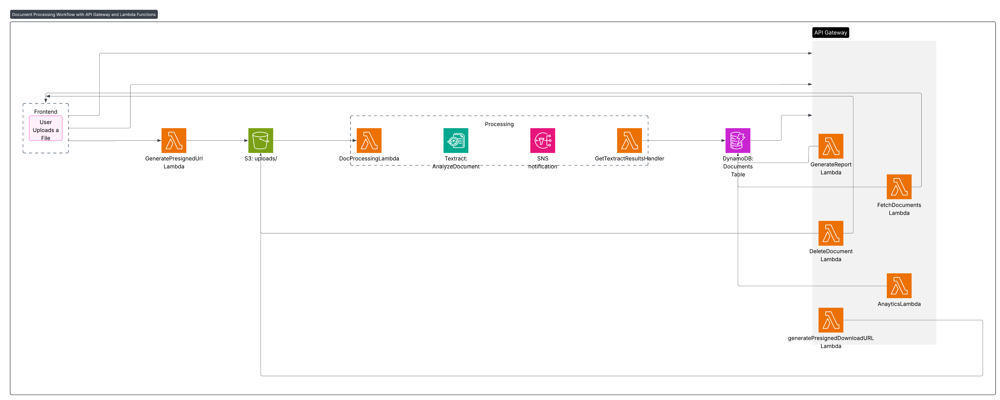
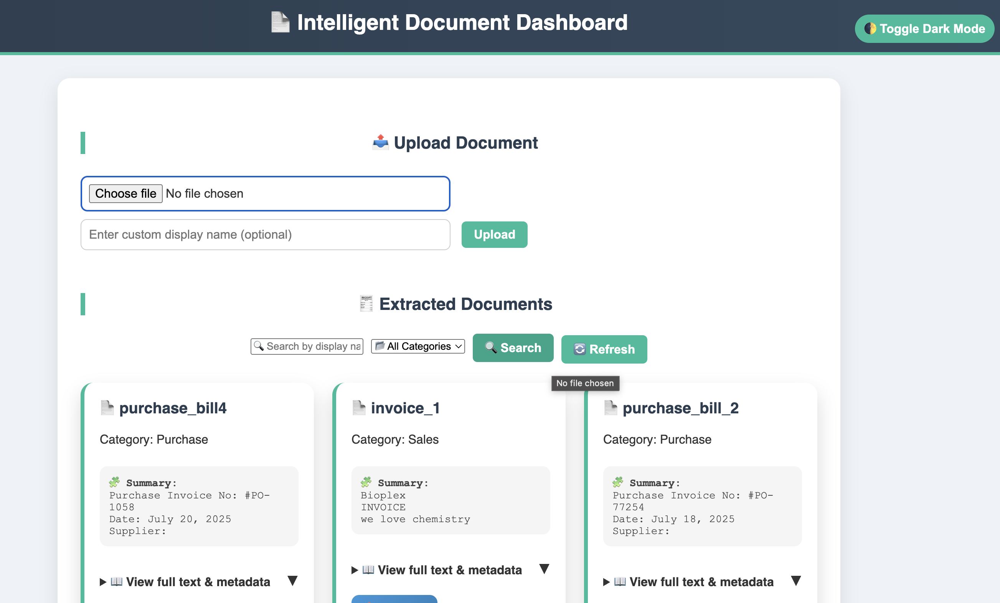
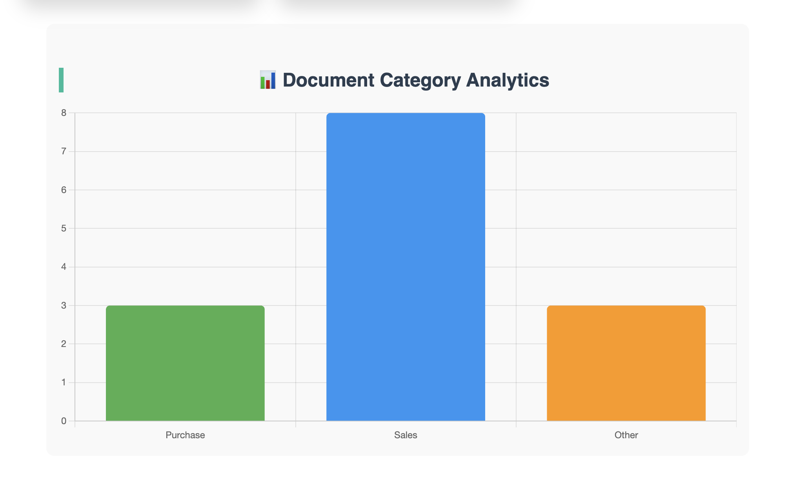
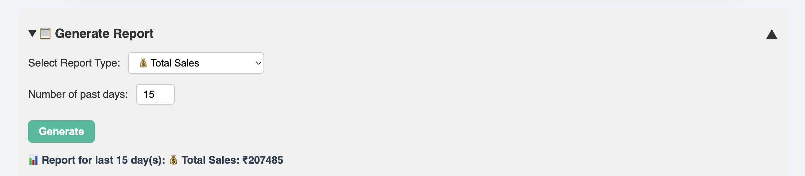
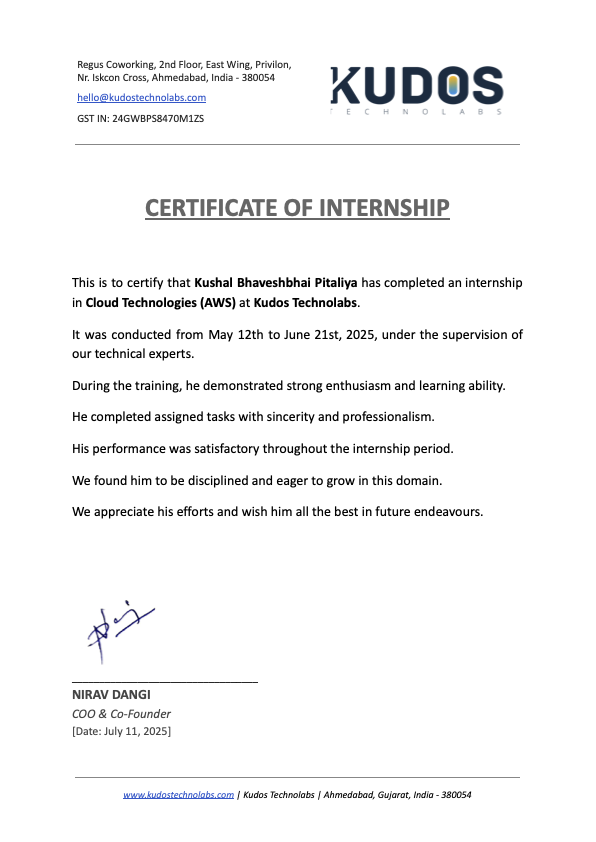

# Intelligent Document Engine using AWS

This repository contains the **HTML**, **CSS**, and **JavaScript** files used to build the **frontend dashboard** for the **Intelligent Document Engine**, a cloud-based document automation solution developed as part of my internship at **Kudos Technolabs**.

---

## 🚨 Problem Statement

Many businesses rely on manual document handling and data entry, which leads to:
- Human errors
- Time-consuming processing
- Lack of structure
- No analytics or search capabilities

This project solves that by automating the entire document workflow using AWS services and providing a clean, interactive dashboard to visualize and analyze the extracted data.

---

## 🎯 Project Goal

To create a **web-based dashboard** that:
- Securely uploads documents
- Displays extracted text from images or PDFs
- Allows searching and filtering
- Provides real-time analytics and dynamic reports
- Works fully within AWS Free Tier

---

## 🧠 Technologies Used

### 🌐 Frontend:
- **HTML**
- **CSS3**
- **JavaScript**

### ☁️ Backend (Connected via API Gateway):
- **Amazon S3** – File upload storage  
- **AWS Lambda** – Serverless backend logic  
- **Amazon Textract** – Text extraction from documents  
- **Amazon DynamoDB** – Structured data storage  
- **Amazon SNS** – Async Textract notification  
- **Amazon API Gateway** – API interface to frontend

---

## 💻 Features

- 📁 **Secure Document Upload** via pre-signed S3 URLs
- 🧾 **Extracted Data Viewer** – Display results in clean format
- 🔍 **Search & Filter** documents by name or keyword
- 📊 **Analytics Panel** – Show total uploads over time
- 📄 **Report Generator** – Generate totals for sales, purchases, turnover, etc.
- 🌙 **Dark Mode Toggle** for better UX
- 🔔 **Toast Notifications** and animated loader for interactivity


## 🖼️ Screenshots

### 🔧 Architecture Diagram  


### 🖥️ Dashboard View  


### 📊 Analytics Panel  


### 📄 Report Generation Example  


### 🧾 Internship Certificate  


---

```markdown
## 🚀 Getting Started

### 1. Clone the Repository

```bash
git clone https://github.com/kushalpitaliya/aws-docu-automation.git
cd aws-docu-automation
